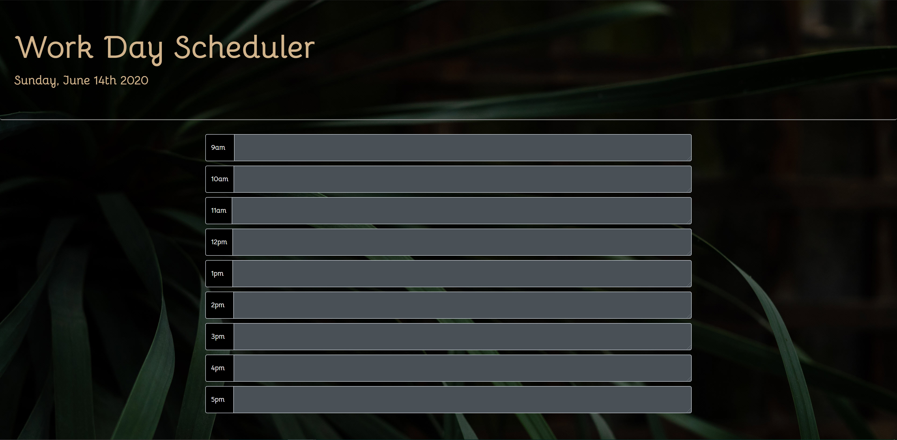
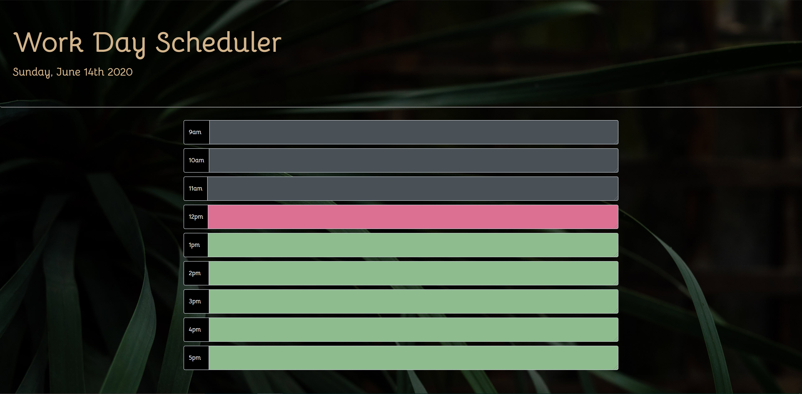
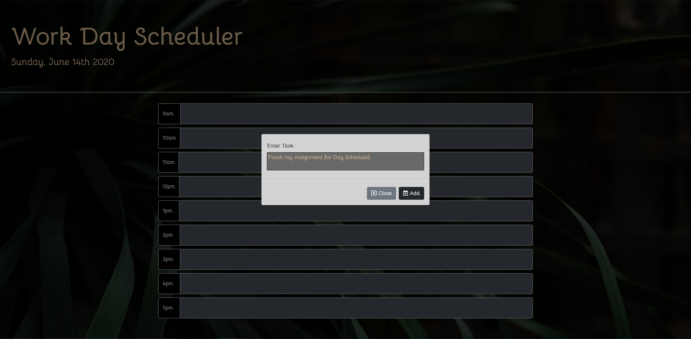

# MBC-unit2

## Application & Repository Link

###### [Application Link](https://suji-gith.github.io/MBC-DayPlanner/DayPlanner.html)

###### [Repository Link](https://github.com/Suji-GitH/MBC-DayPlanner/)

## Content
- [Overview](#Overview)
- [Acceptance Criteria](#AcceptanceCriteria)
- [UI/UX & Application Screens](#UI/UX&ApplicationScreens)
    - [UI/UX Consideration](#UI/UXConsideration)
    - [App Screenshots](#AppScreenshots)
- [Credits](#Credits)
- [Testing](#Testing)

## Overview

AS AN employee with a busy schedule
I WANT to add important events to a daily planner
SO THAT I can manage my time effectively

## AcceptanceCriteria

GIVEN I am using a daily planner to create a schedule  
WHEN I open the planner  
THEN the current day is displayed at the top of the calendar  
WHEN I scroll down  
THEN I am presented with timeblocks for standard business hours  
WHEN I view the timeblocks for that day  
THEN each timeblock is color coded to indicate whether it is in the past, present, or future  
WHEN I click into a timeblock  
THEN I can enter an event  
WHEN I click the save button for that timeblock  
THEN the text for that event is saved in local storage  
WHEN I refresh the page  
THEN the saved events persist  

## UI/UX&ApplicationScreens

###### UI/UXConsideration

Main UI/UX consideration applied is instead of having multiple save button for each time block pop up modal is used the enter the task event. 

###### AppScreenshots

Calendar Landing Page

Colour coordination for Past(), Present(), Future()

Saving times block item

## Credits

    - Bootstrap
    - Google Fonts
    - Favicon.io 
    - jQuery
    - Moment.js 
    - Font Awesome

## Testing

When User is presented with Daily Planner page:

- Current day is displayed at the top of the calendar.

- There are text box with labelled with standard business hours.

- Each time block is color coded to indicate past, present and future. 

When User clicks on the time block, the user is presented with pop up modal containing:

- "Enter Text:" title.

- Input text area. 

- Close and Add Button. 

When User clicks the close button, the pop up modal is closed. 

When User clicks the Add button:

- User input is saved in local storage. 

- The input in the text area is cleared.

- The pop up modal is closed. 

When User has submitted a input through the pop up modal, the inputted text is displayed in the correct time block. 

When user refreshes the page the time block tasks present.
    
